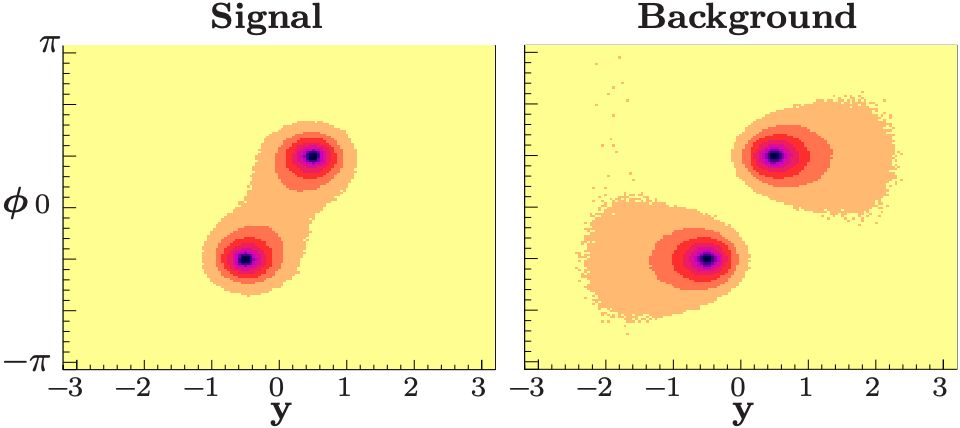
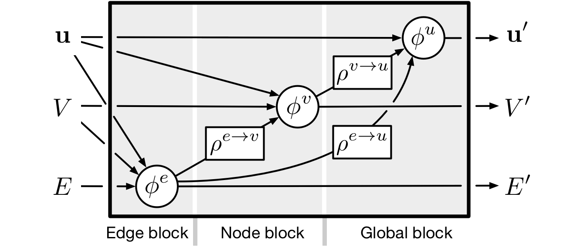

---
index: [index](index.md)
prev: [intro](intro.md)
next: [method](method.md)
...

# Theory || project:progression.report.theory
## Colour observables in jet substructure

Loosely defined, jets are collimated sprays of hadronic particles,
radiated from an initial high energy _parton_, _ie._ gluon or quark.
These structures are ubiquitous in collider experiments. The aim of
such experiments is to direct two particles, accelerated to high energy,
towards each other such that the energy exchange during their interaction
may be sufficient to produce new particles worthy of study. This is known
as a _hard process_. The particle of interest then acts as a seed from which
a branching tree grows. Typically possessing high kinetic energy following
the collision, it radiates and decays into lower energy particles.
These are known as _soft processes_.
An array of detectors in the walls of the collider measure the properties
of the incident _final state_ particles, and those
originating from the seed particle are clustered, in order to
infer the identity of the seed particle and
reconstruct its properties.
Current industry techniques for performing this clustering rely on kinematic
information alone, _ie._ the energy and momentum of the final state
particles.

Jets are loosely described, as their definitions rely on the choice of
algorithm used to cluster them, of which there are several qualitatively
different approaches. The reason behind this lack
of clarity results from an additional degree of freedom in the production
of the observed final state particles. During a collision event,
QCD partons, such as quarks or gluons, may be produced.
Quarks exist in bound states called _hadrons_, held together
by the Strong interaction.
This interaction is mediated via gluons, which are emitted and absorbed by
neighbouring quarks. Each a gluon is exchanged between two quarks, and it may
swap a fundamental property, known as _colour_. Colour is not a visual
phenomenon, as its name suggests, but instead a form of charge associated
with QCD. The analogy with coloured light is more useful than
comparisons with electromagnetism, however, because a bound state of three
quarks - known as a _baryon_ - must each have a
different colour charge, which we call _red_, _green_, and _blue_.
As in the case of light, it is said that this
combination results in a colourless particle, or a _colour singlet_.
In fact, all hadronic matter must be formed of colourless combinations.
Additionally to baryons, this may also be achieved with a
bound quark and anti-quark pair, known as a _meson_.
In this case they are not able to form a colour singlet with
red, green, and blue colours alone, but
they can achieve this if they possess each other's anti-colour,
_eg._ combining red and anti-red quarks.

This description is essential for collision experiments, as at high interaction
energies the particles bound in hadrons appear asymptotically free, _ie._
they may move and interact independently of the other quarks to which
they are bound. A collision event at the LHC involves the high energy
(13 TeV) interaction of two protons, which are baryons, each
consisting of two up quarks and a down quark.
The most likely high energy interaction is between only one quark from each
proton, so the combinatorial possibilities of which flavour
(up or down), and proportion of momentum, which the interacting quarks possess
preclude a precise understanding of the process.
As the momenta along the beam axis (direction along which they are accelerated)
is unlikely to cancel for the interacting pair of quarks, this leads to an
often large Lorentz boost of the products along this axis, which results in
the collimated sprays of final state particles.

It is this ability of individual partons within hadrons to interact as if
independent of each other that results in the degree of freedom which confuses
jet definitions. This is because a shower of particles may be initiated from
an individual high energy quark or gluon, which is not a colour singlet.
Therefore, the particles produced in this shower must interact with
coloured partons, external to their shower, in order to
cancel out this latent colour charge and form singlets in
the final state hadrons. In a trivial case it may only be required for
a small number of coloured particles external to the shower to restore
colour neutrality, however it may be much more elaborate, perhaps with
several showering processes from different partons overlapping and transferring
colour until hadronisation is complete. In this case, it becomes unfeasible
to form the histories of the showering required for current jet clustering
algorithms in a unique way, or to identify a unique seed for a given jet.

Monte-Carlo event generators are able to produce data, in a manner motivated
by QCD phenomenology, which accurately resembles the distributions of
events observed in collider experiments. Typically, the majority of the rich
physical data produced by these algorithms is discarded when defining
clustering techniques, and only the kinematic information is used, as is
the standard with current clustering orthodoxy. However, there is evidence
that the distribution of particles within jets, their so-called
_jet substructure_, indicates the underlying colour flow [@gallicchio_2010].
This intermediate data is available in the history of
showers produced by Monte-Carlo event generators. 
Enriching ML jet clustering algorithms to explicitly distinguish jets,
by inferring the underlying colour dynamics of the process which produced them,
may offer a more robust definition, and lead to more accurate identification.

* [ ] explain results from colour paper  #f01bb940

## Graph definition and representation
Graph structured data is minimally comprised of two pieces of information:
a set of objects, known as _nodes_ or _vertices_ $V$, and
relations between the objects, known as _links_ or _edges_ $E$.
Additionally, a graph may hold high level, or _global_,
properties of its own $u$, _eg._ chemical properties of a drug.
The graph is written in general form as
$$
G = \left( V, E, u \right)
$$
which is often abbreviated simply to $G\left(V, E, u\right)$.

Individual nodes are a member of the set, $v \in V$,
and the edges between them can be described by an adjacency matrix,
$$
A_{ij} = \begin{cases}
1 & \exist \; v_j \in \mathcal{N}(v_i) \\
0 & \text{else}
\end{cases}
$$
where $\mathcal{N}(v_i)$  is the neighbourhood of
node $v_i$. The adjacency matrix is therefore a sparse binary matrix of
order $|V| \times |V|$.

## Message passing
The goal of GNNs is to learn higher level features from the input graph,
which will ultimately be used for inference in the classification
or regression layer.
These _embedded_ features are obtained by transforming the input, such that
the node level information is propagated within its local
neighbourhood. The transformation is parametrised, and thus can
be learned via a NN. This method of transforming features into
higher level embeddings is known as _message passing_.
Many such NN parametrised transformations may be carried out sequentially,
where each represents one layer of the GNN, also referred to as a message
passing layer.

### The graph network formalism
More than simply resulting in updated representations of node
features, message passing may also be used to update the representations of
the previous layer's edge and graph level attributes. In fact, it is often
necessary to compute the embedding of the edges in order to create the
messages to be propagated, _eg._ in graph convolutional networks (GCNs)

The edge, node, and graph level embeddings can be understood in context of
the feed-forward mechanism of the network by considering the general
framework of graph networks (GNs) [@battaglia2018relational]. During this work,
the notation used in the GN formalism will be assumed unless otherwise stated.

In this formalism, a strategy for embedding edge, vertex, and graph level
attributes respectively, is provided in three "blocks".
Two classes of function
enable message passing: the update functions $\phi$ compute the embedded
feature (latent) representations; the aggregation functions $\rho$ pool the
latent representations, which are propagated to the next block
as "messages" for the next level of feature embedding.

We observe that the process begins with the edge embedding.
The update function $\phi^{e}$ concatenates the feature vectors of
a send / receive pair nodes, as well as those of the edge linking them,
and the global features of the graph. Following this, it transforms
the resulting vector into its embedded representation
$\mathbf{e}_k^\prime$, where the subscript indicates the $k$-th edge.
This is repeated for every edge in the graph, obtaining the set $E^\prime$.
To construct messages for the node embedding, $\rho^{e \to v}$
is fed all of
the embedded edges incident on a given receiving node, and performs
a permutation- and size- invariant aggregation,
such as `sum`, `max`, `mean`, _etc_.
The resulting message for the $i$-th node $\bar{\mathbf{e}}_i^\prime$
is fed to $\phi^v$, which concatenates
it with the receiving node's features, and the global
features. The function then performs the parametrised transform on the
resulting vector to its latent representation.
Finally, to obtain the global features of the graph, messages from both
the latent representations of the edges and vertices are constructed.
This is achieved simply by performing permutation-invariant
aggregations over both sets _eg._ `sum`, obtaining a single vector for both
edges and vertices, respectively. These are then concatenated with each other,
and the current graph level feature vector, and transformed into its latent
representation for the given graph layer.
Written mathematically, the update and aggregation functions are shown,
$$
\begin{array}{lll}
\mathbf{e}^\prime_k = \phi^{e}(\mathbf{e}, \mathbf{v}_{r_k},
\mathbf{v}_{s_k}, \mathbf{u})
&
\bar{\mathbf{e}}_i^\prime = \rho^{e \to v}(E_i^\prime)
%% &
%% \text{Edge block}
\\
\mathbf{v}^\prime_i = \phi^{v}(\bar{\mathbf{e}}^\prime_i,
\mathbf{v}_i, \mathbf{u})
&
\bar{\mathbf{e}}^\prime = \rho^{e \to u}(E^\prime)
%% &
%% \text{Vertex block}
\\
\mathbf{u}^\prime = \phi^{u}(\bar{\mathbf{e}}^\prime,
\bar{\mathbf{v}}^\prime, \mathbf{u})
&
\bar{\mathbf{v}}^\prime = \rho^{v \to u}(V^\prime)
%% &
%% \text{Global block}
\end{array}
$$

In practice, the transformations following concatenation - within the update
functions - are often simply multi-layer perceptrons (MLPs), and this
is what will be used and assumed in the rest of this report.

Thus, the feed-forward mechanism produces a graph with the same topology
$G\left(V, E, u\right) \to G^\prime \left(V^\prime, E^\prime, u^\prime\right)$
as the input.
Backpropagation trains the update functions by comparing each output feature
vector, following inference on the final graph representation,
against each training example.
For a given GNN layer, the number of nodes in the input and output
layers of the update function correspond to the initial and final
number of dimensions of the feature vectors transformed.
This therefore represents an inductive - rather than transductive -
strategy, as the underlying NN architecture only expects consistency
in the dimension of the input feature vectors, allowing graphs of
arbitrary size and connectivity to be used for training and inference.
The choice of which data is represented by nodes, edges, and graph level
attributes, and how these data are related, can thus be chosen to
best suit problem to which the GNN is applied.

